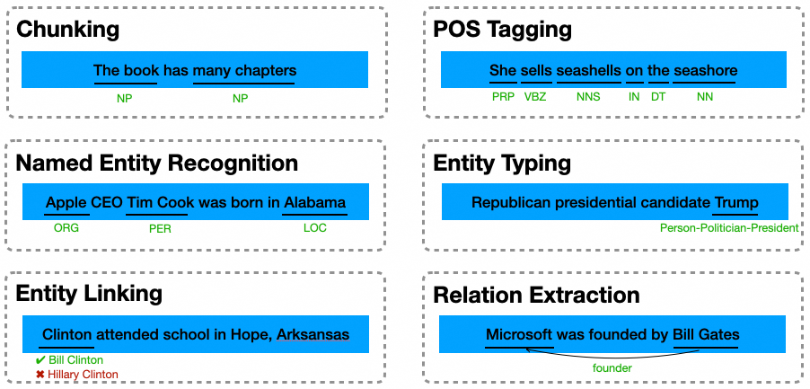

# AdaSeq: An All-in-One Library for Developing State-of-the-Art Sequence Understanding Models

<div align="center">

[](./LICENSE)
[](https://modelscope.cn/)

[](https://github.com/modelscope/AdaSeq/issues)
[](https://github.com/modelscope/AdaSeq/stargazers)
[](https://pypi.org/project/adaseq)
[](./CONTRIBUTING.md)

</div>

<div align="center">

English | [简体中文](./README_zh.md)

</div>

## Introduction
***AdaSeq*** (**A**libaba **D**amo **A**cademy **Seq**uence Understanding Toolkit) is an easy-to-use all-in-one library, built on [ModelScope](https://modelscope.cn/home), that allows researchers and developers to train custom models for sequence understanding tasks, including part-of-speech tagging (POS Tagging), chunking, named entity recognition (NER), entity typing, relation extraction (RE), etc.



<details open>
<summary>🌟 <b>Features:</b></summary>

- **Plentiful Models**:

  AdaSeq provide plenty of cutting-edge models, training methods and useful toolkits for sequence understanding tasks.

- **State-of-the-Art**:

  Our aim to develop the best implementation, which can beat many off-the-shelf frameworks on performance.

- **Easy-to-Use**:

  One line of command is all you need to obtain the best model.

- **Extensible**:

  It's easy to register a module, or build a customized sequence understanding model by assembling the predefined modules.

</details>

⚠️**Notice:** This project is under quick development. This means some interfaces could be changed in the future.

## 📢 What's New
- 2022-07: [SemEval 2023] Our U-RaNER paper won [Best Paper Award](https://semeval.github.io/SemEval2023/awards)!
- 2022-03: [SemEval 2023] Our U-RaNER won ***1st place in 9 tracks*** at [SemEval 2023 Task2](https://multiconer.github.io/results): Multilingual Complex Named Entity Recognition! [Model introduction and source code can be found here](./examples/U-RaNER).
- 2022-12: [[EMNLP 2022] Retrieval-augmented Multimodal Entity Understanding Model (MoRe)](./examples/MoRe)
- 2022-11: [[EMNLP 2022] Ultra-Fine Entity Typing Model (NPCRF)](./examples/NPCRF)
- 2022-11: [[EMNLP 2022] Unsupervised Boundary-Aware Language Model (BABERT)](./examples/babert)

## ⚡ Quick Experience
You can try out our models via online demos built on ModelScope:
[[English NER]](https://modelscope.cn/models/damo/nlp_raner_named-entity-recognition_english-large-news/summary)
[[Chinese NER]](https://modelscope.cn/models/damo/nlp_raner_named-entity-recognition_chinese-base-news/summary)
[[CWS]](https://modelscope.cn/models/damo/nlp_structbert_word-segmentation_chinese-base/summary)

More tasks, more languages, more domains: All modelcards we released can be found in this page [Modelcards](./docs/modelcards.md).

## 🛠️ Model Zoo
<details open>
<summary><b>Supported models:</b></summary>

- [Transformer-based CRF](./examples/bert_crf)
- [Partial CRF](./examples/partial_bert_crf)
- [Retrieval Augmented NER](./examples/RaNER)
- [Biaffine NER](./examples/biaffine_ner)
- [Global-Pointer](./examples/global_pointer)
- [Multi-label Entity Typing](./examples/entity_typing)
- ...
</details>

## 💾 Dataset Zoo
We collected many datasets for sequence understanding tasks. All can be found in this page [Datasets](./docs/datasets.md).

## 📦 Installation
AdaSeq project is based on `Python version >= 3.7` and `PyTorch version >= 1.8`.

- installation via pip：
```
pip install adaseq
```

- installation from source：
```
git clone https://github.com/modelscope/adaseq.git
cd adaseq
pip install -r requirements.txt -f https://modelscope.oss-cn-beijing.aliyuncs.com/releases/repo.html
```

### Verify the Installation
To verify whether AdaSeq is installed properly, we provide a demo config for training a model (the demo config will be automatically downloaded).
```
adaseq train -c demo.yaml
```
You will see the training logs on your terminal. Once the training is done, the results on test set will be printed: `test: {"precision": xxx, "recall": xxx, "f1": xxx}`. A folder `experiments/toy_msra/` will be generated to save all experimental results and model checkpoints.

## 📖 Tutorials
- [Quick Start](./docs/tutorials/quick_start.md)
- Basics
  - [Learning about Configs](./docs/tutorials/learning_about_configs.md)
  - [Customizing Dataset](./docs/tutorials/customizing_dataset.md)
  - [TODO] Common Architectures
  - [TODO] Useful Hooks
  - [Hyperparameter Optimization](./docs/tutorials/hyperparameter_optimization.md)
  - [Training with Multiple GPUs](./docs/tutorials/training_with_multiple_gpus.md)
- Best Practice
  - [Training a Model with Custom Dataset](./docs/tutorials/training_a_model.md)
  - [Reproducing Results in Published Papers](./docs/tutorials/reproducing_papers.md)
  - [TODO] Uploading Saved Model to ModelScope
  - [TODO] Customizing your Model
  - [TODO] Serving with AdaLA

## 📝 Contributing
All contributions are welcome to improve AdaSeq. Please refer to [CONTRIBUTING.md](./CONTRIBUTING.md) for the contributing guideline.

## 📄 License
This project is licensed under the Apache License (Version 2.0).
