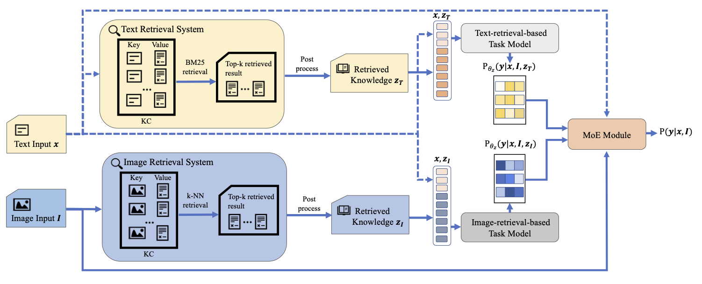

# Named Entity and Relation Extraction with Multi-Modal Retrieval

The MoRe module proposed in the findings of EMNLP 2022 paper: Named Entity and Relation Extraction with Multi-Modal
Retrieval, which aims at improving the performance of multi-modal NER and RE.


## Datasets

To ease the code running, you can find our pre-processed datasets
at [modelscope/datasets/MoRE-processed-data](https://modelscope.cn/datasets/caijiong_sijun/MoRE-processed-data/summary).

## Example of Training

```shell
# train the baseline model
python -m scripts.train -c examples/MoRe/configs/twitter-17.yaml
# train model with image retrieval
python -m scripts.train -c examples/MoRe/configs/twitter-17-img.yaml
# train model with text retrieval
python -m scripts.train -c examples/MoRe/configs/twitter-17-txt.yaml
```

The related config files are listed in `examples/MoRe/configs`.

## Example of MOE Training

Coming soon.

## Benchmarks

### NER

|                                                                              | twitter-15 | twitter-17 | SNAP  | WikiDiverse |
|------------------------------------------------------------------------------|------------|------------|-------|-------------|
| [Wu et al., 2020](https://dl.acm.org/doi/10.1145/3394171.3413650)            | 72.92      | -          | -     | -           |
| [Yu et al., 2020](https://doi.org/10.18653/v1/2020.acl-main.306)             | 73.41      | 85.31      | -     | -           |
| [Sun et al., 2020](https://www.aclweb.org/anthology/2020.coling-main.168)    | 73.80      | -          | 86.80 | -           |
| [Sun et al., 2021](https://ojs.aaai.org/index.php/AAAI/article/view/17633)   | 74.90      | -          | 87.80 | -           |
| [Zhang et al., 2021](https://ojs.aaai.org/index.php/AAAI/article/view/17687) | 74.85      | 85.51      | -     | -           |
| [Wang et al., 2022](https://aclanthology.org/2022.naacl-main.232/)           | 78.03      | 89.75      | 90.15 | 76.87       |
| Ours: Baseline                                                               | 77.04      | 89.11      | 89.65 | 76.58       |
| MoRe-Text                                                                    | 77.79      | 89.49      | 90.06 | 78.29       |
| MoRe-Image                                                                   | 77.57      | 90.28      | 90.46 | 77.81       |

## Citing Us

If you feel the code helpful, please cite

```
@article{Wang2022NamedEA,
  title={Named Entity and Relation Extraction with Multi-Modal Retrieval},
  author={Xinyu Wang and Jiong Cai and Yong Jiang and Pengjun Xie and Kewei Tu and Wei Lu},
  journal={ArXiv},
  year={2022},
  volume={abs/2212.01612}
}
```
