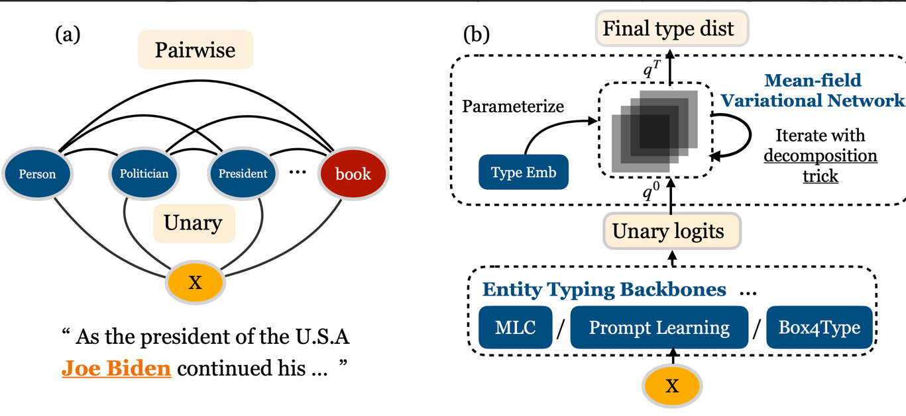

# Neural Pairwise Conditional Random Field for Ultra-Fine Entity Typing

The NPCRF module proposed in the EMNLP 2022 paper: Modeling Label Correlations for Ultra-Fine Entity Typing with
Neural Pairwise Conditional Random Field. NPCRF performs mean-field variational inference on a probabilistic model
designed for better modeling label correlations in ultra-fine entity typing task.


## Static Label Embeding
NPCRF requires static label embeddings, the preprocessed label embeddings (from [GloVe](https://nlp.stanford.edu/projects/glove/) for EN, Tencent for ZH)
can be downloaded here: [UFET](https://drive.google.com/file/d/1cizhVviRtBohmBkwlC6V2fhmJGeA0rAJ/view?usp=share_link), [CFET](https://drive.google.com/file/d/1cizhVviRtBohmBkwlC6V2fhmJGeA0rAJ/view?usp=share_link),
and you can place them in yoru folder and run the following config: (you need to reset your **target_emb_dir** in the config).
Or you can provide the path of the glove embedding file (e.g., /path/to/your/glove.6B.300d.txt) and the code will generate label embedding for you.

## Example of Training a model with NPCRF
```
python -m scripts.train -c examples/npcrf/configs/ufet_concat_npcrf.yaml
```

## Benchmarks
| UFET                | ma-F1 | ma-P | ma-R |
|---------------------|-------|------|------|
| NPCRF-roberta-large | 47.1  | 49.5 | 44.9 |
