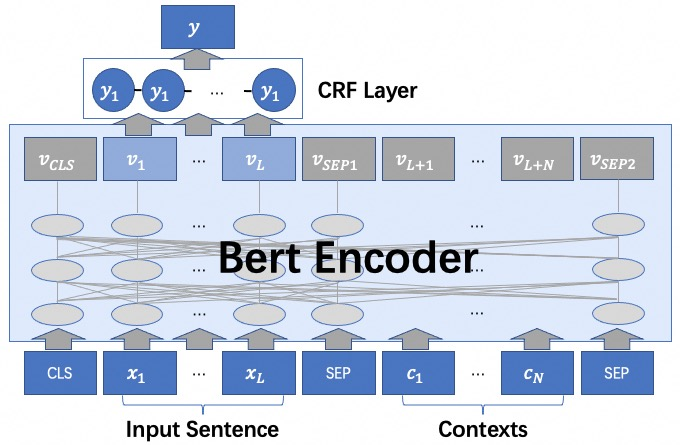

# SemEval 2023 Task 2: MultiCoNER II Baseline

This tutorial introduces 2 strong baseline systems (non-official) for SemEval 2023 Task 2: MultiCoNER II:
- Bert-CRF
- Retrieval-Augmented NER (RaNER)

Based on RaNER, we can easily reproduce the champion solution of MultiCoNER I: [DAMO-NLP at SemEval-2022 Task 11:
A Knowledge-based System for Multilingual Named Entity Recognition](https://aclanthology.org/2022.semeval-1.200.pdf)

## Table of Contents
- [Quick Start](#quick-start)
- [Method](#method)
  - [Bert-CRF](#bert-crf)
  - [Retrieval-Augmented NER](#retrieval-augmented-ner)
- [Retrieval-Augmented Dataset](#retrieval-augmented-dataset)
- [Experiment Results](#experiment-results)
- [Citation](#citation)

## Quick Start
To train **Bert-CRF** model on original datasets:
```commandline
adaseq train -c examples/SemEval2023_MultiCoNER_II/configs/orig/bn.yaml
```

To train **RaNER** model on retrieval-augmented datasets:
```commandline
adaseq train -c examples/SemEval2023_MultiCoNER_II/configs/wiki128/bn.yaml
```

## Method

### Bert-CRF
Bert-CRF is a widely used NER method by simply adding a CRF layer on the Transformer model.
The backbone is not necessarily Bert. We use XLM-R large as the embedding for all languages.

### Retrieval-Augmented NER
RaNER is a variant of Bert-CRF, where the retrieved data act as extra contexts for encoder but are ignored when calculating loss. For more information, please refer to ACL-IJCNLP 2021 paper: [Improving Named Entity Recognition by External Context Retrieving and Cooperative Learning](https://arxiv.org/pdf/2105.03654.pdf)



## Retrieval-Augmented Dataset
We construct multilingual KBs based on Wikipedia pages of the 12 languages, and then retrieve relevant documents by using the input sentence as a query. These retrieved documents act as extra contexts and are fed into the NER module.

The retrieval-augmented dataset is provided on [https://modelscope.cn/datasets/pangda/multico_ner_2023_wiki128/summary](https://modelscope.cn/datasets/pangda/multico_ner_2023_wiki128/summary). Anyone can download it or use it via AdaSeq.

## Experiment Results

|      Method       |  data   |  bn   |   de   |  en   |  es   |  fa   |  fr   |  hi   |  it   |  pt   |  sv   |  uk   |  zh   |  avg  |
|:-----------------:|:-------:|:-----:|:------:|:-----:|:-----:|:-----:|:-----:|:-----:|:-----:|:-----:|:-----:|:-----:|:-----:|:-----:|
| Official Baseline |  orig   | 1.07  | 	64.61 | 36.97 | 49.07 | 41.28 | 41.39 | 2.89  | 43.13 | 39.85 | 69.22 | 62.08 | 48.46 | 41.67 |
|     Bert-CRF      |  orig   | 77.06 | 73.17  | 60.68 | 65.04 | 59.40 | 61.41 | 83.80 | 71.12 | 63.94 | 68.4  | 65.71 | 72.60 | 68.53 |
|       RaNER       | wiki128 | 89.12 | 76.78  | 71.32 | 68.24 | 76.76 | 74.61 | 88.78 | 83.43 | 76.7  | 77.06 | 78.26 | 75.84 | 78.08 |

## Citation
```
@inproceedings{wang-etal-2021-improving,
    title = "Improving Named Entity Recognition by External Context Retrieving and Cooperative Learning",
    author = "Wang, Xinyu  and
      Jiang, Yong  and
      Bach, Nguyen  and
      Wang, Tao  and
      Huang, Zhongqiang  and
      Huang, Fei  and
      Tu, Kewei",
    booktitle = "Proceedings of the 59th Annual Meeting of the Association for Computational Linguistics and the 11th International Joint Conference on Natural Language Processing (Volume 1: Long Papers)",
    month = aug,
    year = "2021",
    address = "Online",
    publisher = "Association for Computational Linguistics",
    url = "https://aclanthology.org/2021.acl-long.142",
    pages = "1800--1812",
}

@inproceedings{wang-etal-2022-damo,
    title = "{DAMO}-{NLP} at {S}em{E}val-2022 Task 11: A Knowledge-based System for Multilingual Named Entity Recognition",
    author = "Wang, Xinyu  and
      Shen, Yongliang  and
      Cai, Jiong  and
      Wang, Tao  and
      Wang, Xiaobin  and
      Xie, Pengjun  and
      Huang, Fei  and
      Lu, Weiming  and
      Zhuang, Yueting  and
      Tu, Kewei  and
      Lu, Wei  and
      Jiang, Yong",
    booktitle = "Proceedings of the 16th International Workshop on Semantic Evaluation (SemEval-2022)",
    month = jul,
    year = "2022",
    address = "Seattle, United States",
    publisher = "Association for Computational Linguistics",
    url = "https://aclanthology.org/2022.semeval-1.200",
    pages = "1457--1468",
}
```
