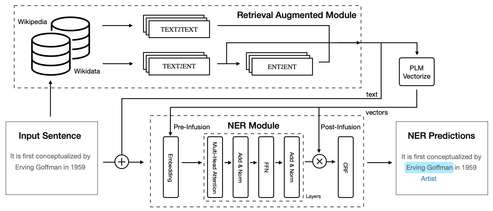

# U-RaNER: A Unified Retrieval-augmented System for Multilingual Named Entity Recognition


The code is for the winner system (DAMO-NLP) of SemEval 2023 MultiCoNER II shared task over 9 out of 13 tracks. [[Rankings]](https://multiconer.github.io/results), [[Paper]](https://arxiv.org/pdf/2305.03688.pdf).

U-RaNER is a unified retrieval-augmented system, where we use both Wikipedia and Wikidata knowledge bases to build our retrieval module and explore the infusion approach to make more context visible to the model.



## Guide

- [Quick Start](#quick-start)
  - [Datasets](#datasets)
  - [Trained Models](#trained-models)
  - [Training on MultiCoNER II Datasets](#training-on-multiconer-ii-datasets)
  - [Config File](#config-file)
- [Building U-RaNER System](#Building-U-RaNER-System)
	- [Retrieval Augmentation Module](#Retrieval-Augmentation-Module)
  - [Named Entity Recognition Module](#named-entity-recognition-module)
  - [Multi-stage Fine-tuning](#Multi-stage-Fine-tuning)
  - [Ensemble Module](#Ensemble-Module)
- [Citation](#Citation)

## Quick Start

### Datasets

To ease the code running, please download our pre-processed datasets.

datasets: TBD

---

### Trained Models

Since there are 100+ trained models for our submission in the test phase, we only release our trained models for English (monolingual), Multilingual.

ckpts: TBD

---

### Training on MultiCoNER II Datasets

```commandline
adaseq train -c examples/SemEval2023_MultiCoNER_II/configs/wiki2048/bn.yaml
```

#### Experiment Results

|      Method       |  data   |  bn   |   de   |  en   |  es   |  fa   |  fr   |  hi   |  it   |  pt   |  sv   |  uk   |  zh   |  avg  |
|:-----------------:|:-------:|:-----:|:------:|:-----:|:-----:|:-----:|:-----:|:-----:|:-----:|:-----:|:-----:|:-----:|:-----:|:-----:|
| Official Baseline |  orig   | 1.07  | 	64.61 | 36.97 | 49.07 | 41.28 | 41.39 | 2.89  | 43.13 | 39.85 | 69.22 | 62.08 | 48.46 | 41.67 |
|     Bert-CRF      |  orig   | 77.06 | 73.17  | 60.68 | 65.04 | 59.40 | 61.41 | 83.80 | 71.12 | 63.94 | 68.4  | 65.71 | 72.60 | 68.53 |
|       RaNER       | wiki128 | 89.12 | 76.78  | 71.32 | 68.24 | 76.76 | 74.61 | 88.78 | 83.43 | 76.7  | 77.06 | 78.26 | 75.84 | 78.08 |
|       U-RaNER       | wiki2048 | 91.24  | 82.41  | 81.86  | 80.82  | 81.25  | 83.48  | 90.85  | 87.66  | 83.42  | 82.06  | 83.27  | 78.94  | 83.94 |

---

### Config File

You can find all the config files at [here](https://github.com/modelscope/AdaSeq/tree/master/examples/SemEval2023_MultiCoNER_II/configs).

## Building U-RaNER System

### Retrieval Augmentation Module
Following [[wang-etal-2022-damo]](https://aclanthology.org/2022.semeval-1.200.pdf), we build a multilingual KB based on Wikipedia of the 12 languages to search for the related documents.
We download the latest (2022.10.21) version of the Wikipedia dump from Wikimedia and convert it to plain texts. The detailed processing procedure can be referred to [[KB-NER]](https://github.com/Alibaba-NLP/KB-NER#Knowledge-Base-Building).

In addition, we explore to enhance our retrieval system with Wikidata.
Wikidata is a free and entity-centric knowledge base. Every entity of Wikidata has a page consisting of a label, several aliases, descriptions, and one or more entity types. The detailed procedure of entity linking can be found in our paper.

---

### Named Entity Recognition Module
We use xlm-roberta-large (XLM-R) [[conneau-etal-2020-unsupervised]](https://aclanthology.org/2020.acl-main.747.pdf) as the initial checkpoint. The token representations are fed into a CRF layer to get the conditional probability, and the model is trained by maximizing the conditional probability and minimizing the cross entropy loss. Additionally, we utilize the infusion approach that [[lewis2020retrieval]](https://arxiv.org/abs/2005.11401) uses for better information interaction to provide a more extensive contextual view to the model, thus enabling better utilization of the retrieved context. Please refer to our code for more details.

---

### Multi-stage Fine-tuning
[[Wang-etal-2022-damo]](https://aclanthology.org/2022.semeval-1.200.pdf) experimentally demonstrates that MSF can leverage the annotations from all tracks and thus improve performance and accelerate training.
In addition, we observe that inconsistent training set sizes on different language tracks can also lead to degradation of model performance. We use increasing batch size and upsampling strategy to address this issue.

|      Method        |  bn   |   de   |  en   |  es   |  fa   |  fr   |  hi   |  it   |  pt   |  sv   |  uk   |  zh   |  avg  |
|:-----------------:|:-----:|:------:|:-----:|:-----:|:-----:|:-----:|:-----:|:-----:|:-----:|:-----:|:-----:|:-----:|:-----:|
| RaNER w/ batch 4   | 82.02 | 80.82 | 85.60 | 88.46 | 85.27 | 87.53 | 86.56 | 89.80 | 87.26 | 89.77 | 89.17 | 68.59 | 85.07 |
|     RaNER w/ batch 128   | 88.09 | 83.23 | 85.87 | 89.40 | 85.59 | 88.18 | 89.57 | 91.84 | 88.97 | 90.01 | 88.97 | 72.11 | 86.82 |
|       RaNER w/ scaling  | 90.82 | 86.27 | 85.86 | 89.88 | 86.15 | 88.70 | 90.99 | 91.50 | 89.24 | 90.85 | 88.95 | 75.71 | 87.91 |

---

### Ensemble Module

The ensemble module ranks all spans in the predictions by the number of votes in descending order and selects the spans with more than 50\% votes into the final prediction.

```commandline
python -m tools.experiment.ensemble
```

---

## Citation
```
@inproceedings{tan2023damonlp,
      title={DAMO-NLP at SemEval-2023 Task 2: A Unified Retrieval-augmented System for Multilingual Named Entity Recognition},
      author={Zeqi Tan and Shen Huang and Zixia Jia and Jiong Cai and Yinghui Li and Weiming Lu and Yueting Zhuang and Kewei Tu and Pengjun Xie and Fei Huang and Yong Jiang},
      year={2023},
      eprint={2305.03688},
      archivePrefix={arXiv},
      primaryClass={cs.CL}
}
